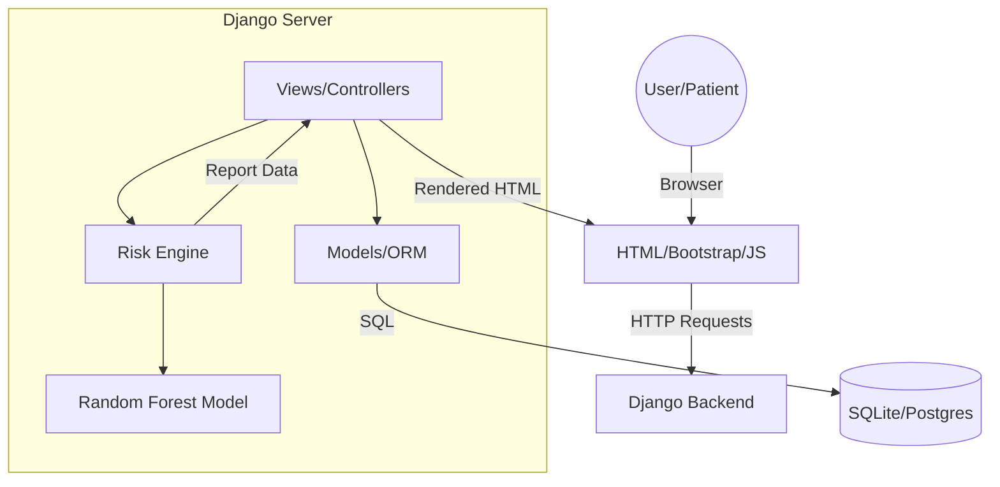

# High-Level Design (HLD)

## 1. System Overview
ArogyaCheck is a monolithic Django application designed for high availability in low-bandwidth scenarios.

## 2. Architecture Diagram

## 3. Module Description
- **Accounts**: Manages user session and roles.
- **Patients**: Handles health data and the risk prediction logic.
- **Dashboard**: Aggregates data for clinical review.

Detailed architecture: [HLD/SYSTEM_ARCHITECTURE.md](HLD/SYSTEM_ARCHITECTURE.md)
