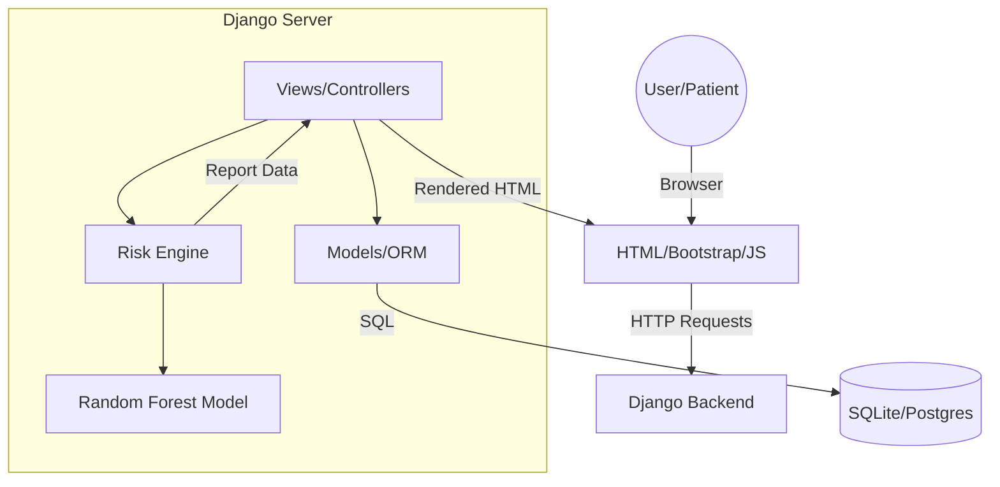

# High-Level Design: System Architecture

## 1. Executive Summary
ArogyaCheck is a health diagnostic platform designed for early screening of lifestyle diseases. It is optimized for rural environments with low bandwidth.

## 2. Technology Stack
- **Backend**: Django (Python)
- **Machine Learning**: Scikit-learn (Random Forest)
- **Database**: SQLite (Development) / PostgreSQL (Production)
- **Frontend**: HTML5, Vanilla CSS, Bootstrap, JavaScript
- **Visualization**: Plotly

## 3. System Architecture Diagram
The system follows the Model-View-Template (MVT) pattern.

## 4. Key Components
- **Accounts App**: Handles user authentication and profile management.
- **Patients App**: Manages patient health profiles and questionnaires.
- **Dashboard App**: Provides data visualization and risk summaries.
- **Risk Engine**: The core logic that combines ML predictions with clinical heuristics.

## 5. Deployment Strategy
Optimized for Server-Side Rendering (SSR) to reduce client-side processing and improve performance on 2G/3G networks.
