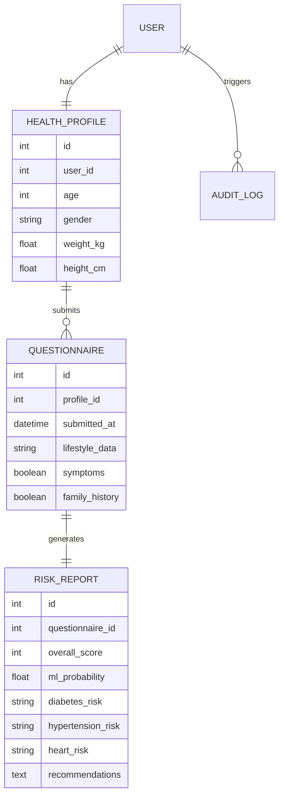

# Low-Level Design: Database Design

## 1. Entity Relationship Diagram (ERD)
The database is designed to track patient profiles, their health questionnaire submissions, and the resulting risk reports.

## 2. Data Models Detail
### 2.1 User & Health Profile
- **User**: Standard Django user model for authentication.
- **HealthProfile**: Stores static/semi-static patient information like Age, Gender, and BMI-related data.

### 2.2 Questionnaire & Risk Report
- **Questionnaire**: Captures point-in-time data from the user.
- **RiskReport**: Stores the output of the Risk Engine, including ML probabilities and heuristic-based scores.

## 3. Integrity Constraints
- Foreign keys ensure that reports are always linked to a valid questionnaire.
- Audit logs track all major changes for medical traceability.
