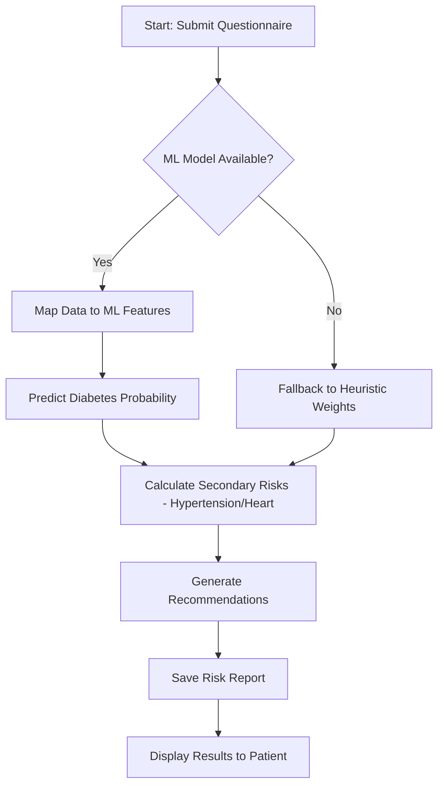

# Low-Level Design: Risk Engine Logic

## 1. Overview
The Risk Engine is a hybrid system that utilizes both Machine Learning (Random Forest) and clinical heuristic weights to provide a comprehensive health assessment.

## 2. Logic Flowchart

## 3. Algorithm Details
### 3.1 ML Prediction (Diabetes)
- **Model**: Random Forest Classifier.
- **Input Features**: Age, BMI, Glucose, Blood Pressure, Insulin, etc.
- **Output**: Probability of risk (0.0 to 1.0).

### 3.2 Heuristic Engine (Hypertension & Heart)
- **Hypertension Risk**: Calculated based on Blood Pressure readings and BMI.
- **Heart Risk**: Combined weight of Age, Smoking status, and BMI.

## 4. Normalization & Scoring
Results are normalized into three risk categories:
- **Low (Green)**: Score < 30%
- **Moderate (Yellow)**: 30% <= Score < 70%
- **High (Red)**: Score >= 70%
