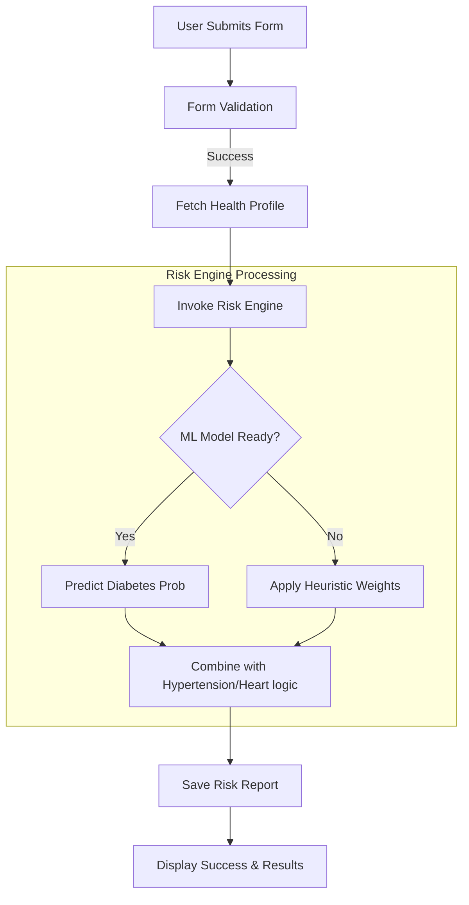
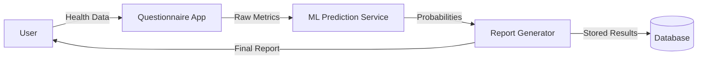

# LLD: Data Flow & Process Diagrams (DFD)

## 1. Risk Assessment Process Flow
This diagram shows the end-to-end data processing when a user submits their health data.

## 2. Data Flow Diagram (Level 1)

