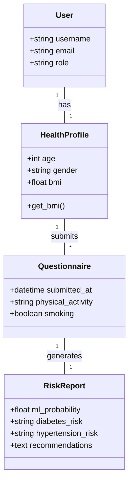
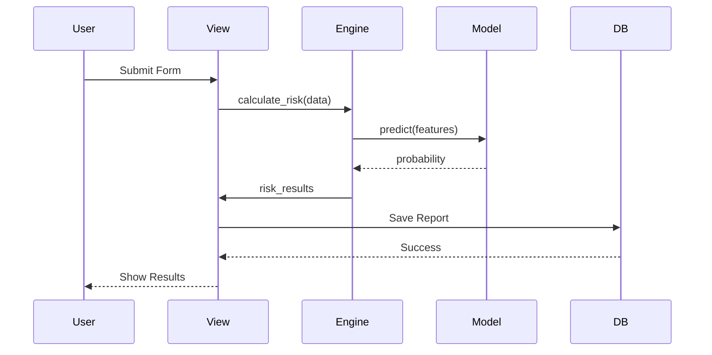

# LLD: UML Diagrams

## 1. Class Diagram
The core relationships between Django models.

```mermaid
classDiagram
    class User {
        +string username
        +string email
        +string role
    }
    class HealthProfile {
        +int age
        +string gender
        +float bmi
        +get_bmi()
    }
    class Questionnaire {
        +datetime submitted_at
        +string physical_activity
        +boolean smoking
    }
    class RiskReport {
        +float ml_probability
        +string diabetes_risk
        +string hypertension_risk
        +text recommendations
    }

    User "1" -- "1" HealthProfile : has
    HealthProfile "1" -- "*" Questionnaire : submits
    Questionnaire "1" -- "1" RiskReport : generates
```

## 2. Sequence Diagram (Risk Calculation)

```mermaid
sequenceDiagram
    participant User
    participant View
    participant Engine
    participant Model
    participant DB

    User->>View: Submit Form
    View->>Engine: calculate_risk(data)
    Engine->>Model: predict(features)
    Model-->>Engine: probability
    Engine->>View: risk_results
    View->>DB: Save Report
    DB-->>View: Success
    View-->>User: Show Results
```
